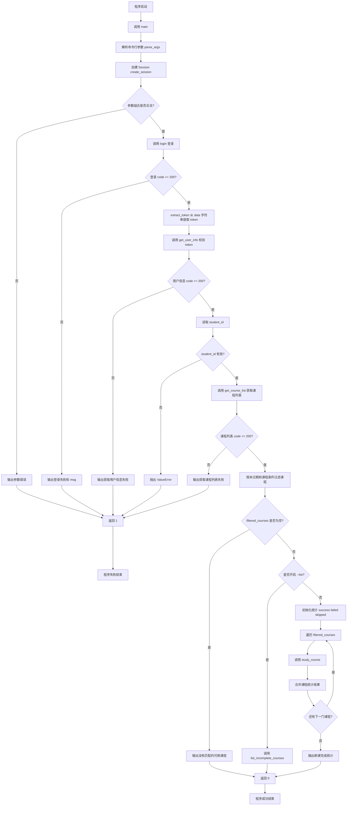

# `main()` 函数流程说明

本文档说明 `haiqikeji/cli.py` 中 `main()` 函数的执行流程、关键分支、调用链以及返回语义，便于理解程序如何从顶层命令行入口一路调度到章节、小节的自动学习逻辑。

## 1. 函数定位

- 顶层程序启动位置：`main.py`
- CLI 调度函数定义位置：`haiqikeji/cli.py` 的 `main()`

程序通过以下顶层入口启动：

```python
from haiqikeji.cli import main

if __name__ == "__main__":
    raise SystemExit(main())
```

因此，`main.py` 负责作为顶层入口，`haiqikeji.cli.main()` 是整个 CLI 工具的总控入口，负责串联参数解析、登录认证、课程筛选、列表模式与刷课模式分发，以及统一异常处理。

## 2. `main()` 的核心职责

`main()` 并不直接执行章节或小节学习，而是负责完成以下总调度：

1. 解析命令行参数
2. 创建 HTTP 会话
3. 校验参数组合是否合法
4. 登录并提取 token
5. 校验 token 并获取用户信息
6. 获取课程列表
7. 过滤出符合条件的课程
8. 根据模式决定：
   - 仅列出未完成课程结构
   - 或正式执行自动刷课
9. 汇总并输出统计结果
10. 捕获并处理网络或解析异常

## 3. 相关输入参数

`main()` 依赖 `build_parser()` 构建命令行参数解析器，定义位置在 `haiqikeji/cli.py`。

对流程控制影响最大的参数如下：

| 参数 | 说明 | 对流程的影响 |
| --- | --- | --- |
| `-n` / `--number` | 登录账号/学号 | 登录必填 |
| `-p` / `--password` | 登录密码 | 登录必填 |
| `--sid` / `--school-id` | 学校 ID | 影响登录、课程查询 |
| `--cid` / `--course-id` | 指定课程 ID | 过滤课程范围 |
| `--cn` / `--course-name` | 课程名关键词 | 过滤课程范围 |
| `--chid` / `--chapter-id` | 指定章节 ID | 缩小刷课范围，要求配合 `--cid` |
| `--nid` / `--node-id` | 指定小节 ID | 精确刷单个小节，要求配合 `--cid` 和 `--chid` |
| `--step` / `--progress-step` | 心跳间隔秒数 | 影响学习进度上报节奏 |
| `--skip` / `--skip-complete` | 跳过已完成小节 | 影响刷课遍历逻辑 |
| `--list` / `--list-incomplete` | 仅列出未完成项 | 决定是否进入刷课分支 |
| `-v` / `--verbose` | 启用 DEBUG 级别输出 | 用于调试接口响应和进度 |
| `--log-file` | 输出文件日志 | 文件日志保留时间、级别、函数名和行号 |

## 4. `main()` 详细执行流程

### 4.1 初始化阶段

```python
args = build_parser().parse_args()
logger = setup_logging(...)
session = create_session()
```

该阶段完成三件事：

1. 读取命令行参数，生成 `args`
2. 初始化控制台/文件日志
3. 创建并初始化 `requests.Session`

其中 `create_session()` 会预置浏览器请求头、Cookie 和重试策略，使后续请求更接近真实浏览器行为。

### 4.2 参数合法性校验

`main()` 对章节、小节的定向刷课参数做了前置约束：

- 如果指定 `--nid`，则必须同时指定 `--cid` 和 `--chid`
- 如果指定 `--chid`，则必须同时指定 `--cid`

对应结果如下：

- 参数不合法：输出错误信息并 `return 1`
- 参数合法：继续执行登录流程

这样可以避免用户只提供局部定位信息，导致程序无法唯一确定目标章节或小节。

### 4.3 登录阶段

```python
login_result = login(session, args.number, args.password, args.school_id)
```

此处调用 `login()` 向平台发起登录请求。登录成功的判断条件是：

```python
login_result.get("code") == 200
```

若登录失败：

- 输出 `登录失败`
- 输出接口返回的 `msg`
- 直接 `return 1`

### 4.4 提取 token

```python
token = extract_token(login_result)
```

`extract_token()` 从登录响应中提取认证 token。当前平台真实响应结构为：

```json
{"code": 200, "msg": "登录成功", "data": "<JWT token>"}
```

因此 `extract_token()` 只接受 `data` 为非空字符串的结构。若登录接口表面成功，但 `data` 不是有效 token 字符串，会抛出 `ValueError`，并由 `main()` 外层异常处理统一接管。

### 4.5 校验 token 并获取用户信息

```python
user_info_result = get_user_info(session, token)
```

该步骤有两个目的：

1. 验证 token 是否真实可用
2. 从用户信息中提取后续请求必须使用的 `student_id`

判断逻辑：

- 如果 `user_info_result.get("code") != 200`，则输出错误并 `return 1`
- 如果 `student_id` 缺失或类型不合法，则抛出 `ValueError`

这里的 `student_id` 是后续获取课程列表、学习进度和刷课请求的重要标识。

### 4.6 获取课程列表

```python
course_list_result = get_course_list(session, token, args.school_id, student_id)
```

`get_course_list()` 用于拉取当前学生的课程列表。若接口返回 `code != 200`：

- 输出 `获取课程列表失败`
- 输出接口返回的 `msg`
- `return 1`

如果成功，则进入课程过滤阶段。

### 4.7 课程过滤

`main()` 会先拿到原始课程列表，再用以下条件生成 `filtered_courses`：

1. 课程未过期
2. 符合用户指定的课程筛选条件

对应函数如下：

- `is_unexpired_course(course, today)`
- `course_matches(course, args.course_id, args.course_name)`

过滤规则说明：

- 未过期：`endDate >= today`
- 若指定 `--cid`，则只保留对应课程 ID
- 若指定 `--cn`，则按课程名关键词做不区分大小写的包含匹配

如果过滤后为空：

- 输出 `没有匹配的可刷课程`
- `return 0`

这里返回 `0` 表示程序运行正常，只是当前没有符合条件的课程。

### 4.8 列表模式分支

如果用户启用了 `--list`：

```python
list_incomplete_courses(...)
return 0
```

此时程序不会进入自动刷课逻辑，而是调用 `list_incomplete_courses()` 按层级打印未完成的小节：

```text
课程 [课程ID] 课程名
  [章节ID] 章节名
    - [小节ID] 小节名
```

因此，`--list` 可以理解为一个只读检查模式。

### 4.9 正式刷课分支

如果没有开启 `--list`，则进入自动刷课分支：

1. 输出 `开始自动刷课`
2. 通过 `_new_study_results()` 初始化总统计字典
3. 遍历 `filtered_courses`
4. 对每门课程调用 `study_course()`
5. 通过 `_merge_study_results()` 把单门课程结果合并到总统计中

调用形式如下：

```python
course_results = study_course(
    session=session,
    token=token,
    school_id=args.school_id,
    student_id=student_id,
    course=course,
    heartbeat_interval_seconds=args.progress_step,
    skip_complete=args.skip_complete,
    chapter_id=args.chapter_id,
    node_id=args.node_id,
)
```

也就是说，`main()` 在这一层负责的是课程级调度，而不是直接操作具体小节。

### 4.10 输出统计结果

全部课程处理完成后，程序会用单行输出汇总：

```text
成功 x | 失败 y | 跳过 z | 总计 n
```

需要注意的是：

- `return 0` 代表主流程完整执行结束
- 不代表所有课程或小节都刷成功
- 小节级失败会体现在统计数据里，而不是直接导致进程退出码变成 `1`

### 4.11 统一异常处理

`main()` 使用 `try/except` 对外层关键异常做统一兜底：

#### 1. `requests.HTTPError`

- 表示 HTTP 状态码层面的请求失败
- 输出状态码信息
- 返回 `1`

#### 2. `requests.RequestException`

- 表示连接失败、超时、网络中断等请求异常
- 输出网络失败提示
- 返回 `1`

#### 3. `ValueError`

- 表示响应解析失败，例如 token 缺失、`student_id` 非法
- 输出解析失败信息
- 返回 `1`

## 5. `main()` 的下游调用链

`main()` 自身只做总调度，真正的学习动作在下层函数中展开。

调用链如下：

```text
main()
  → study_course()
      → get_course_chapter_tree()   # 一次调用获取章节+小节树
      → get_course_progress()       # 获取课程的小节进度列表
      → build_node_progress_map()   # 构建 {node_id: progress_data}
      → study_chapter(nodes)        # 直接传入小节列表
          → _study_node_with_progress_policy()
              → auto_study_node()
                  → get_node_progress()
                  → study_session_start()
                  → study_session_heartbeat()
                  → study_session_end()
```

### 5.1 `study_course()`

职责：

- 调用 `get_course_chapter_tree()` 一次性获取课程的章节-小节树形结构（`data` 为章节数组，每项含 `children` 小节数组）
- 调用 `get_course_progress()` 获取课程整体学习进度
- 使用 `build_node_progress_map()` 构建 `{node_id: progress_data}` 映射
- 根据 `chapter_id` / `node_id` 决定学习范围
- 遍历章节时，直接读取 `chapter["children"]` 获取小节列表，传给 `study_chapter()`

### 5.2 `study_chapter()`

职责：

- 接收 `nodes` 参数（该章节的小节列表，来自章节的 `children` 字段）
- 从 `progress_map` 读取每个小节的进度数据
- 对每个有效小节调用 `_study_node_with_progress_policy()`
- 合并小节学习结果

### 5.3 `_study_node_with_progress_policy()`

职责：

- 使用 `is_complete_progress()` 判断小节是否已完成
- 已完成且启用 `--skip`：记录跳过并返回
- 已完成但未启用 `--skip`：记录重刷，并让 `auto_study_node()` 从 0 开始
- 未完成：让 `auto_study_node()` 继续使用断点续刷
- 将结果归类到 `success`、`failed`、`skipped`

### 5.4 `auto_study_node()`

职责：

1. 获取小节最新进度（`get_node_progress`，用于断点续刷）
2. 启动学习会话 `study_session_start()`
3. 按心跳间隔循环调用 `study_session_heartbeat()`，进度从断点位置递增到 100%
4. 进度达到 100% 后调用 `study_session_end()`
5. 发生错误时会尝试保存当前进度并结束会话

该函数才是真正执行“刷单个小节”的核心逻辑。

## 6. 控制台输出格式

控制台日志由 `setup_logging()` 配置为只显示消息正文，不显示时间戳和 `INFO` 前缀。文件日志不受影响，指定 `--log-file` 后仍会记录详细时间、级别、函数名和行号。

正式刷课输出示例：

```text
自动刷课工具 | 用户: <账号>
正在登录...
正在验证用户信息...
正在获取课程列表...
匹配课程: 1 个

开始自动刷课

课程 [课程ID] 课程名
  [章节ID] 章节名
    - [跳过] 小节名
    - [重刷] 小节名

刷课完成
成功 0 | 失败 0 | 跳过 31 | 总计 31
```

## 7. `main()` 流程图

下面是适合直接用于 Markdown 渲染的 Mermaid 流程图：



## 8. 关键分支总结

从控制流程角度看，`main()` 最重要的判定点有以下几个：

1. 参数是否合法
2. 登录是否成功
3. token 是否有效，用户信息能否获取
4. 课程列表是否获取成功
5. 过滤后是否存在可处理课程
6. 当前是否为 `--list` 模式

其中最关键的业务分支是：

- 没有匹配课程：正常结束
- 开启 `--list`：只输出未完成结构
- 未开启 `--list`：进入正式刷课流程

## 9. 返回值语义

`main()` 的返回值表示的是“程序主流程是否正常完成”，而不是“所有小节是否都刷成功”。

### 返回 `0`

表示程序整体运行成功，例如：

- 没有匹配课程，但流程正常完成
- 仅列表模式执行完成
- 刷课流程执行完成，并输出统计结果

### 返回 `1`

表示入口级失败，例如：

- 参数非法
- 登录失败
- 获取用户信息失败
- 获取课程列表失败
- HTTP 请求异常或网络异常
- 响应结构解析失败

## 10. 一句话概括

`main()` 的本质是：先完成参数解析、登录认证和课程筛选，再根据运行模式决定是“列出未完成项”还是“逐课程调度刷课逻辑”，最后统一输出统计结果并处理异常。
